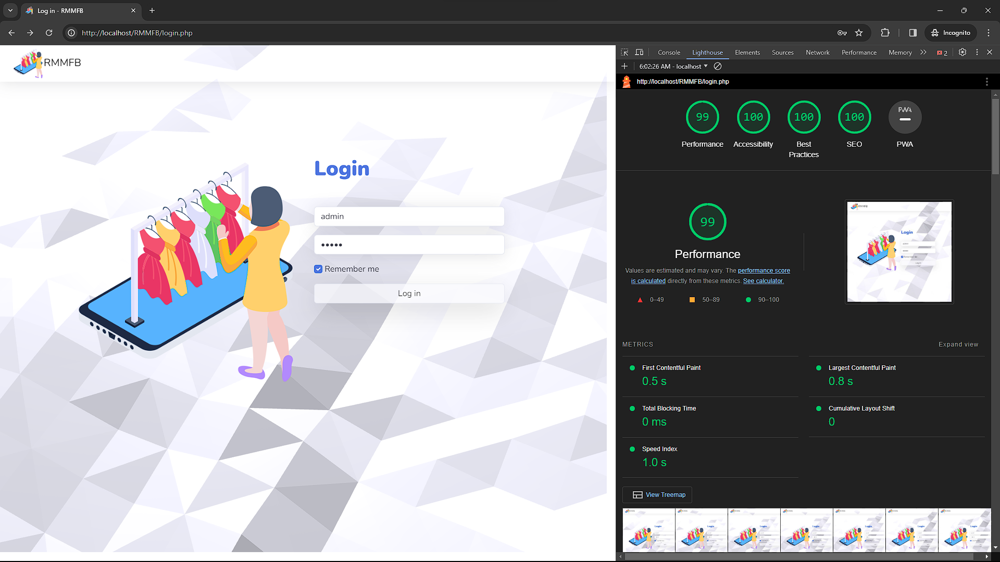
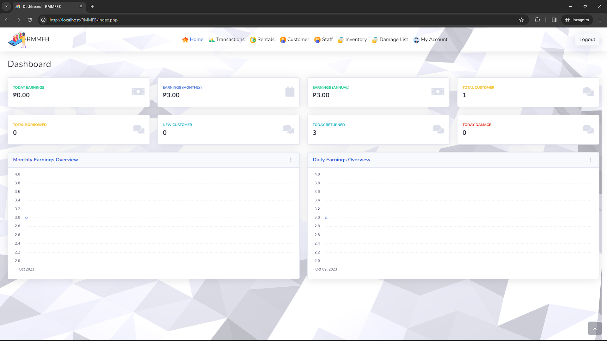

## RMMFB - Rental Management and Monitoring for a Fashion Boutique (Web Application)

|                                          **System Functionality**                                         | 20% | 40% | 60% | 80% | 100% |
|:---------------------------------------------------------------------------------------------------------:|-----|-----|-----|-----|------|
| Users Management (Staff & Customer) - View Users - Create User - Update User - Remove User                | ✅   | ✅   | ✅   | ✅   | ⭐    | 
| Inventory Management - View Items - Add Item - Update Item - Remove Item - Item Stock In - Item Stock Out | ✅   | ✅   | ✅   | ✅   | ⭐    |
| Rental Monitoring - View Rentals not yet returned                                                         | ✅   | ✅   | ✅   | ✅   |⭐     |
| Sales Monitoring - View Transactions / Sales                                                              | ✅   | ✅   | ✅   | ✅   |     ⭐|
| Users Activity Monitoring - User Activity Log (ex: Inventory)                                             | ✅   | ✅   | ✅   | ✅   | ⭐    | 
| Generate Reports (EXCEL, PDF, PRINT)                                                                      | ✅   | ✅   | ✅   | ✅   | ⭐    |

## XAMPP System Specifications

| Tool            | Version                             |
|-----------------|-------------------------------------|
| Database Server | 10.4.28-MariaDB - mariadb.org binary distribution |
| Web Server      | Apache/2.4.56 (Win64) OpenSSL/1.1.1t PHP/8.2.4 |
| Database Client | libmysql - mysqlnd 8.2.4             |
| PHP             | 8.2.4                               |
| phpMyAdmin      | 5.2.1 (up to date)                   |

## Administrator Credentials
| Username | Password |
|----------|----------|
| admin    | admin    |

## Screenshots

